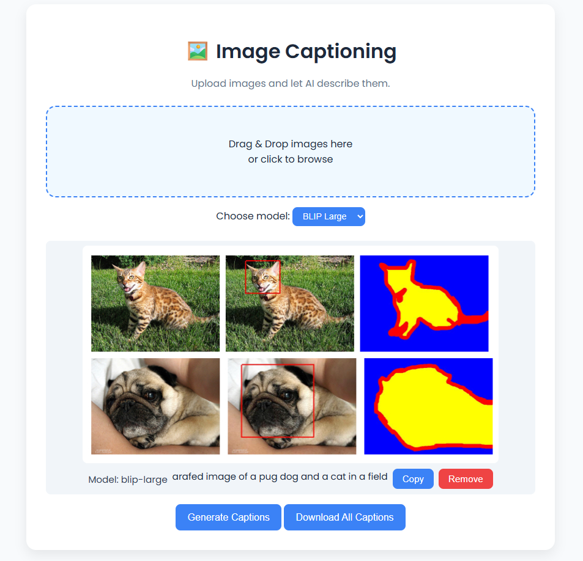

# Image Captioning Service

A web service that generates captions for images using a deep learning model. Includes a **FastAPI backend** and a **static frontend**. Containerized with Docker and deployable on Kubernetes (Minikube or cloud).

 

---

## Features

* Upload an image via web interface
* Generate descriptive captions
* Dockerized backend and frontend
* Kubernetes manifests with ingress support
* Backend readiness detection

---

## Structure

```
project-root/
├─ app/                # Backend
│  ├─ app.py
│  ├─ utils.py
│  ├─ requirements.txt
│  └─ Dockerfile
├─ frontend/           # Static frontend
│  ├─ index.html
│  ├─ script.js
│  ├─ style.css
│  └─ Dockerfile
├─ kubernetes/         # K8s manifests
├─ docker-compose.yaml
└─ README.md
```

---

## Local Docker Run

```bash
docker build -t backend ./app
docker build -t frontend ./frontend
docker run -p 8000:8000 backend
docker run -p 3000:80 frontend
```

Access frontend: `http://localhost:3000`
Backend API: `http://localhost:8000/caption`

---

## Kubernetes (Minikube)

```bash
minikube start
kubectl apply -f kubernetes/
kubectl port-forward svc/image-caption-backend 8000:8000
minikube service image-caption-frontend
```

---

## Cloud Deployment (Optional)

1. Push images to Docker Hub or cloud registry:

```bash
docker tag backend <username>/image-caption-backend:latest
docker push <username>/image-caption-backend:latest
docker tag frontend <username>/image-caption-frontend:latest
docker push <username>/image-caption-frontend:latest
```

2. Update K8s manifests to use cloud images.
3. Deploy on cloud Kubernetes (GKE, EKS, AKS) and expose via LoadBalancer or ingress.

---

## Frontend Upgrades

* Drag-and-drop image uploads
* Progress bar for uploads
* Use frameworks (React/Vue) for dynamic UI
* Configurable API endpoint via env variables

---

## Notes

* Backend loads ML model on startup; initial requests may be slow.
* CORS is enabled for development. Update for production.
* Ingress can unify frontend and backend paths.

---
